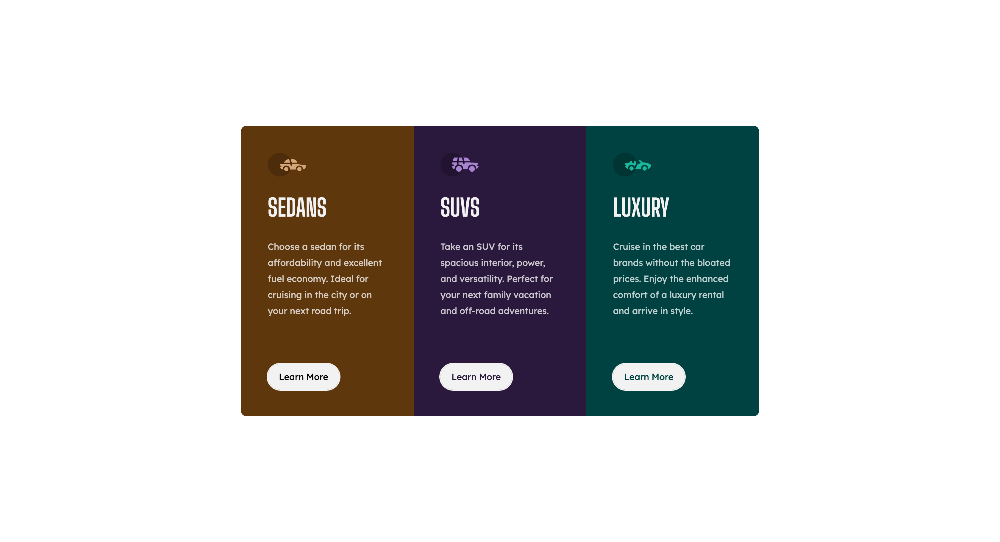

## Table of contents

- [Links](#links)
- [The challenge](#the-challenge)
- [Screenshot](#screenshot)
- [Author](#author)

### Links

- Solution URL: [https://github.com/Smgy94/frontend-mentor-3-column-preview-card-component]()
- Live Site URL: [https://smgy94.github.io/frontend-mentor-3-column-preview-card-component/]()

# Frontend Mentor - 3-column preview card component solution

This is a solution to the [3-column preview card component challenge on Frontend Mentor](https://www.frontendmentor.io/challenges/3column-preview-card-component-pH92eAR2-). Frontend Mentor challenges help you improve your coding skills by building realistic projects.

### The challenge

Users should be able to:

- View the optimal layout depending on their device's screen size
- See hover states for interactive elements

### Screenshot

### Built with

- Semantic HTML5 markup
- CSS custom properties
- Flexbox
- CSS Grid
- Mobile-first workflow

**Note: These are just examples. Delete this note and replace the list above with your own choices**

## Author

- Frontend Mentor - [@Smgy94](https://www.frontendmentor.io/profile/Smgy94)
- Twitter - [@ShaneMcGeown94](https://twitter.com/ShaneMcGeown94)
- LinkedIn - [in/shanemcgeown/](https://www.linkedin.com/in/shanemcgeown/)
